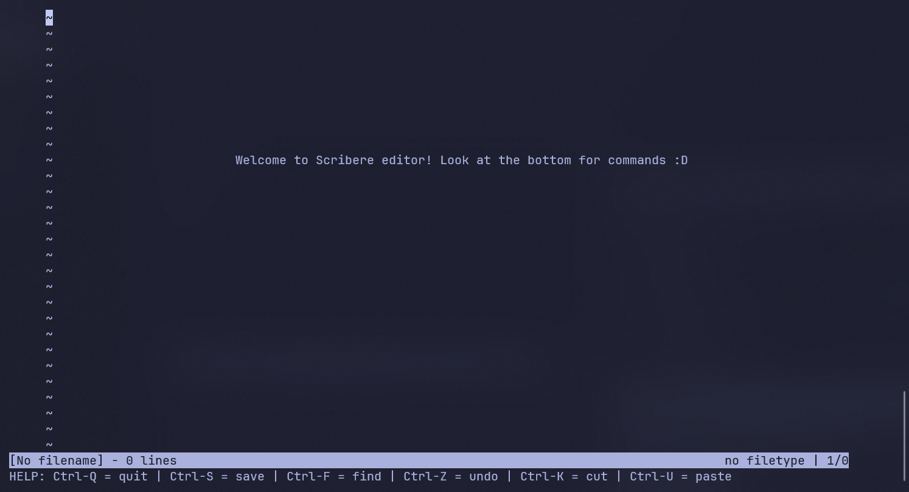
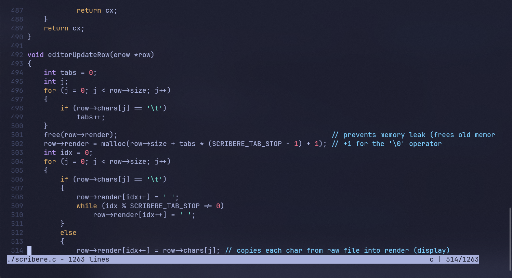

## 
Scribere

 A terminal code editor which is <em>fast</em> and <em>lightweight</em>

## Overview

It is a text editor i made using the kilo guide and i am currently adding my own features to it.

It is made using c so it is very lightweight (currently ~35kb)

The syntax highlighting currently only supports c language, more soon.

## Features

- You can search for <em>any specific word</em> in code
- You can undo your changes using Ctrl-Z
- Warning system which warns if you have any unsaved changes
- <b>Syntax highlighting</b> so it looks like a code editor

## Getting started

-- wip --

## Roadmap

- [ ] Allow us to copy and paste things into the terminal
- [ ] More languages support for syntax highlighting

## Images

The terminal look different from what u fork because i modified the look of my powershell terminal.

## References

- [Kilo text editor](https://viewsourcecode.org/snaptoken/kilo/index.html)
