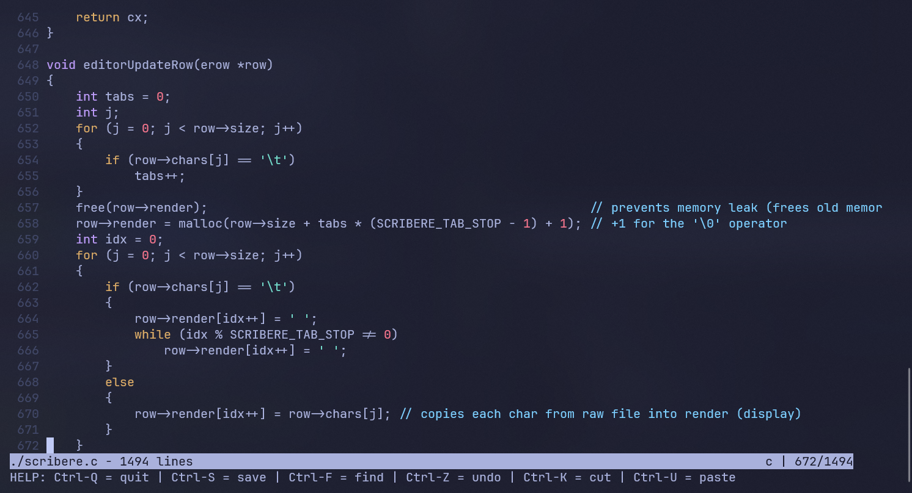

## 
Scribere

 A terminal code editor that is simple and lightweight

## Overview

Code editor similar to vim or nano but made by me.

It is made using c so the filesize is very less (currently ~55kb)

It is made using the kilo guide but with tons of more features.

Fun fact: Scribere means *"to write"* in latin

## Features

- You can undo your changes.
- You can find text within the file.
- Warning system which warns if you have any unsaved changes.
- <b>Syntax highlighting</b> and filetype detection. 
- Currently syntax highlighting and filetype detection only supports the following filetypes:- 
  C, Python, Javascript, Go, Rust, Java, Bash, Yaml, Json, Makefile, Dockerfile, Gitignore
- Copy and paste things inside the terminal as you like but u can only copy and paste things within the terminal.

## Images

\*The terminal might look different from screenshots because i modified the look of my powershell terminal.\*

## Getting started

Works in Linux / MacOS / Windows (Only WSL)
I have already compiled and built the app but if you want to the build it yourself, do the following:-

- ### Clone
  `git clone https://github.com/bys-exe/scribere.git`
  `cd scribere`
  
- ### Build
  run `make` in the directory
  or
  `gcc -o scribere scribere.c -Wall -Wextra` 
  
  (<em>-o is to set the name of the output file and -Wall and -Wextra are used to enable all warnings</em>)

- ### Run
  type `./scribere filename.c` for opening a file
  or
  type `./scribere` for opening an empty file

## Keybinds

| Keybind | Action |
| :---: | :---: |
| Ctrl-S | Save |
| Ctrl-Q | Quit* |
| Ctrl-F | Find |
| Ctrl-Z | Undo |
| Ctrl-K | Cut line |
| Ctrl-U | Paste |
| Arrow Keys | Move cursor |
| Page Up/Down | Scroll |

  *You have to press the keybind three times to quit with unsaved changes

## References

- [Kilo text editor](https://viewsourcecode.org/snaptoken/kilo/index.html)
